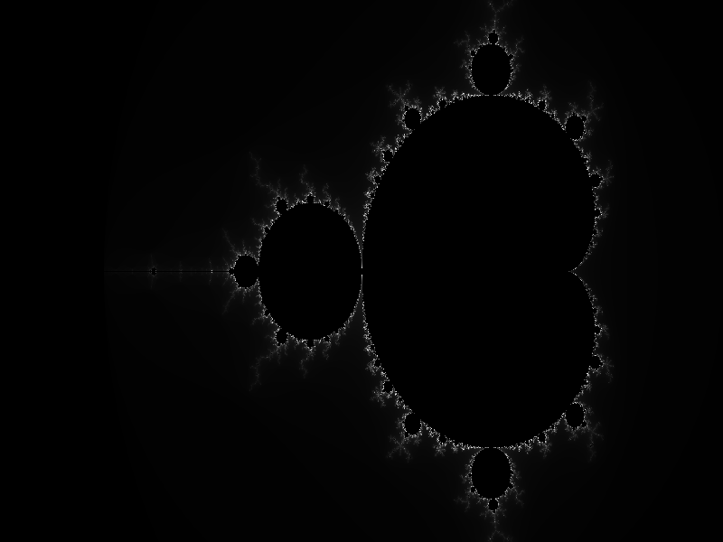
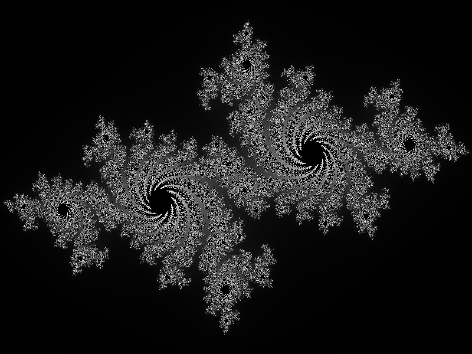
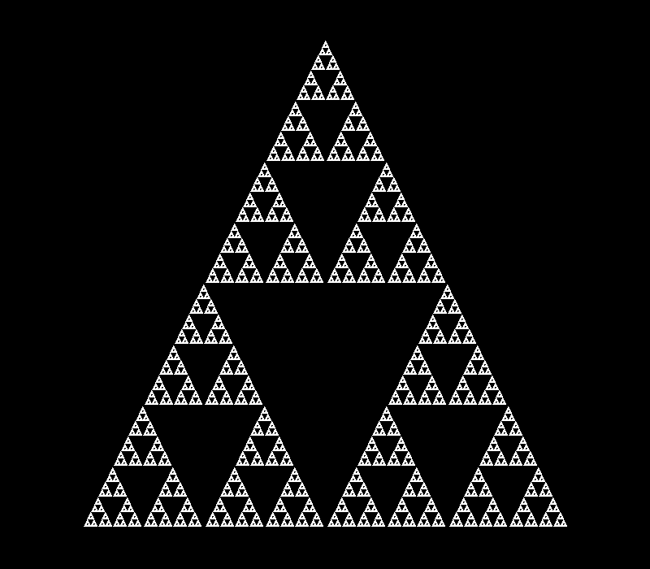
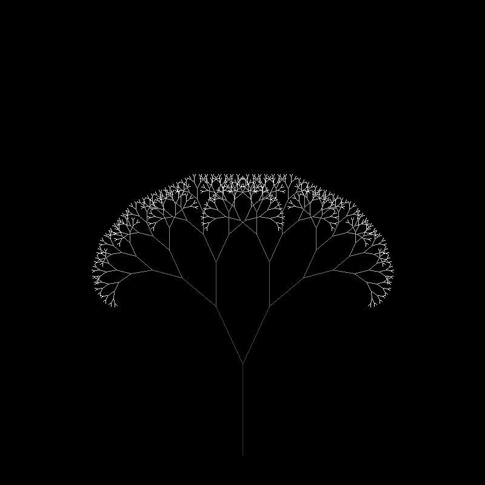

# Генератор фракталов


Программа для генерации различных фрактальных изображений с сохранением в форматах BMP и PGM.

## Примеры сгенерированных фракталов

### 1. Множество Мандельброта


*Область: [-2.5, 1.0] × [-1.0, 1.0], 256 итераций*

### 2. Множество Жюлиа


*Константа: c = (-0.7, 0.27015i), область: [-1.5, 1.5] × [-1.0, 1.0]*

### 3. Треугольник Серпинского


*Глубина рекурсии: 7, размер: 600 пикселей*

### 4. Древовидный фрактал


*Глубина: 10, начальная длина: 150 пикселей*

## Сборка и запуск

```bash
# Клонирование репозитория
git clone https://github.com/DadakhodjaevRustam/Fractal.git
cd Fractal

# Сборка
mkdir build && cd build
cmake .. && make

# Запуск
./fractal_generator
